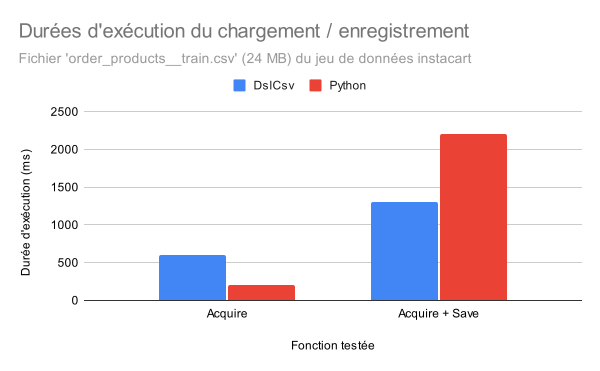

# DSL CSV

Dans le cadre du [cours de DSL du Master SIF](https://github.com/FAMILIAR-project/HackOurLanguages-SIF), nous avons pour objectif de concevoir et d'implémenter un DSL pour le traitement de fichiers CSV.

## I - Conception

Le langage est conçu avec un typage faible afin que l'utilisateur ait le moins de question de types à se poser et soit permissif sur les opérations. La syntaxe est proche de langages traditionnellement utilisés par le public cible du langage (les Data Scientists qui utilisent par exemple R) et s'inscrit donc dans un écosystème qui leur est familier. Des exemples sont disponibles dans le [dossier "examples"](examples/).

### Métamodèle

Le métamodèle du langage est relativement simple. La taille du graphe est due au nombre de méthodes primitives définies.

Le diagramme est accessible dans le [dossier de documentation](doc/dslCsv%20class%20diagram.svg).

## Modèle

Au delà des types simples (String et Integer), le langage manipule deux autres types principaux :

* `File` représentant des données en deux dimensions
* `Vector` représentant des données à une seule dimension

## II - Implémentation

Le langage a été implémenté dans l'environnement Eclipse Modeling Framework avec XText et XTend (plus précisément, un pretty-printer ainsi que des ébauches d'interpréteur et de compilateur en bash).

Le développement a été rendu difficile par le fait qu'un des membres du binôme n'a pas pu installer les environnements de développement. Ainsi, le travail a pu très difficilement être parallélisé et rendait pour ce dernier les tests très difficiles.

### 1) Dépendances

Au delà de l'environnement de développement XText, quelques dépendances ont été requises.

#### Interprétation

* La bibliothèque `dslcsv` (qui elle-même requiert `common-langs3`) est requise pour l'interpréteur. Ces deux bibliothèques sont fournies au format JAR dans le dossier `fr.irisa.dslcsv/external-jars`.

#### Tests de performance (benchmark)

* Pour se comparer aux standards existants, la bibliothèque `pandas` a été utilisée en Python pour comparer ses performances.

### 2) Interpréteur

Le typage faible a amené à de nombreux problèmes de typage difficilement solubles, rendant les implémentations ainsi que les tests, nécessitant de nombreuses vérifications de type, laborieux et chronophages. Ainsi, un sous ensemble assez restreint a été implémenté.

L'interpréteur est basé sur une méthode statique `eval` qui prend en paramètre une expression à évaluer (surchargée grâce au mot-clé `dispatch` de XText) et un contexte d'évaluation gardant une trace des valeurs des variables.

* Évaluation de constantes
    * Entiers
    * Chaînes de caractères
    * Vecteurs de type arbitraire
* Assignation (enregistre le résultat de l'opérande de droite avec l'étiquette du membre de gauche)
* Variables (retourne la valeur enregistrée à la dernière assignation)
* Évaluation d'expressions (Logique bit-à-bit, opérations sur entiers, comparaisons d'entiers et de flottants)
* Méthodes essentielles
    * `Acquire` chargement d'un fichier en mémoire avec un séparateur donné et un booléen (y a-t-il une colonne d'identifiants ?)
    * `Save` (partiel) enregistre un fichier paramètres :
        * Nom de fichier
        * Fichier à enregisrer
        * Séparateur
        * Doit-on enregistrer les en-têtes ? (non implémenté)
        * Doit-on enregistrer la colonne id si elle existe ? (non implémenté)
    * `Select` sélectionne certaines colonnes d'un fichier (ne fonctionne pas correctement)
    * `Print` affiche en console un élément (les fichiers sont affichés avec des tabulations et retours à la ligne)

* La classe `InterpretationContext` représente le contexte d'interprétation (garde une trace des sorties standard et variables)

### 3) Fichiers modifiés manuellement

Pour mieux se retrouver dans le flot des fichiers générés automatiquement par XText et XTend, voici ci-dessous la liste des fichiers modifiés manuellement (et non auto-générés) :

* `fr.irisa.dslcsv/src/fr/irisa/` Racine du projet
    * `DslCsv.xtext` Grammaire et métamodèle du langage
* `fr.irisa.dslcsv/src/fr/irisa/model/` Types non primitifs (en Java) utilisés pour le métamodèle (voir section [Modèle](#modèle))
* `fr.irisa.dslcsv/src/fr/irisa/generator/` Compilateurs et interpréteurs
    * `TypeException.java` Exception de type détectée à la compilation
    * `ASTtoBash.xtend` Compilateur d'AST vers Bash
    * `ASTtoInterpretation.xtend` Interpréteur
    * `ASTtoPP.xtend` Pretty-printer
    * `DslCsvGenerator.xtend` Generator de XText (événements à l'enregistrement dans l'IDE Eclipse généré)
* `fr.irisa.dslcsv/external-jars/` Dépendance externe au format JAR
* `fr.irisa.dslcsv` Tests unitaires (et plus complets)

## III - Benchmark

Les méthodes implémentées ont été testées face à un code équivalent en Python utilisant des bibliothèques orientées machine learning (très bien optimisées pour ce genre d'opérations et très utilisées dans le domaine, ce qui permet de comparer notre implémentation face aux standards du marché).

Les jeux de données utilisés sont extraits de la compétition [Instacart Market Basket Analysis](https://www.kaggle.com/c/instacart-market-basket-analysis).

### 1) Acquire

Pour le programme suivant :

```
Acquire("order_products__train.csv", ",", 1)
```

En moyennant plusieurs exécutions, le cycle complet (parsing + interprétation) dure environ 600ms.

Pour le programme équivalent en python ci-dessous, un cycle prend 200ms.

```py
pandas.read_csv('order_products__train.csv', sep=',')
```

### 2) Save

Pour un programme chargeant et enregistrant un fichier :

```
a=Acquire("order_products__train.csv", ",", 1);
Save("order_products__train_copy.csv", a, ",", 1, 1)
```

Notre langage prend 1.3 secondes et le code python équivalent prend environ 2.2 secondes.

### 3) Bilan



En somme, la différence de temps d'exécution peut s'expliquer par la différence de philosophie du langage. Les données sont stockées au format textuel dans notre langage, contrairement à pandas qui interprète les nombres. En effet, ce dernier est conçu pour des traitements assez simples avant une utilisation externe (par exemple, dans un langage de machine learning). Ainsi, le chargement est plus lent et la mémoire utilisée plus importante, mais une conversion des nombres vers un format texte vers n'est pas requise pour l'enregistrement.

## IV - Conclusion

Si le projet était à refaire, une politique de typage plus forte serait à préconiser. Le point de vue de l'implémentation a été relativement oublié lors de la conception, ce qui s'est fait ressentir par la suite. Un langage aussi permissif en terme de type n'est pas implémentable en seulement 2 mois avec quelques heures par semaine. Les objectifs auraient dû être revus à la baisse dès la conception afin d'être réalisables. Ce projet a cependant été très instructif d'un point de vue méthodologique.


